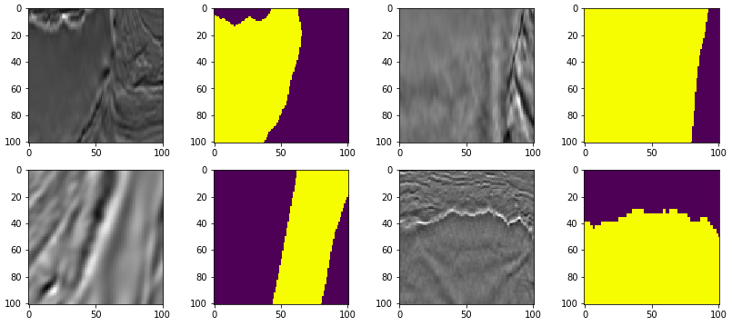
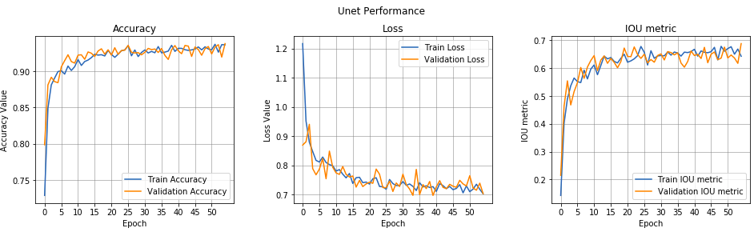
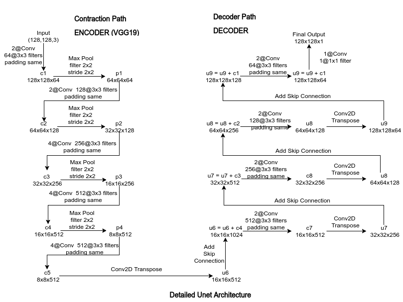

# TGS_Salt_Identify_Kaggle-ImgSeg-DL
This is a Kaggle competition on Image Segmentation. We have to identify pixels in seismic images with salt sediment present. Here I will use UNet (Encoder and Decoder) to tackle the challenge.
[Fork the Solution notebook](https://colab.research.google.com/drive/1SizODTyCuC8wF4U0Llr3vjv3fw3_R198)

## Problem
In the problem, there were 4000 seismic images with their corresponding Masks. So to tackle the challenge we have to segment each pixel of seismic image as salt sediment is present or not. The mask are submitted as Run-Length Encoding. Below is the sample seismic images and their corresponding masks.

## Solution
I tried different Unet network architectures such as 

1. Encoder and Decoder of Unet from Scratch.
2. Pretrained VGG16 as Encoder and Decoder from scratch.
3. Pretrained ResNet34 as Encoder and Decoder from scratch.
4. Pretrained VGG19 as Encoder and Decoder from scratch.

My final submission was with "Pretrained VGG19 as Encoder and Decoder" which has given me **Private Score of 0.67620** and **Public Score of 0.64851**. Training and Validaiton metrics of Trained model are given below.

## Model Architecture
I have used combination of multiple losses which includes lovasz_hinge, binary crossentropy, dice loss with weightage 0.7, 0.15, and 0.15 respectively. Also I have used Conv2D transpose layers for upsampling. Detailed architecure is given below.

I have used the metric called IOU (Intersection over Union) metric to track progress and trained Unet with Adam optimizer for 40-60 epochs with decaying learning rate between 1e-3 to 1e-4. I have also performed Image augmentation with include horizontal flip, brightness change, zoom. Train and test split was stratified using depth.

## Concepts Learned
1. Image Segmentation
2. Unet
3. Lovasz loss
4. Dice Loss
5. Intersection over Union (IOU) metric

## Author:
* Aditya Jain : [Portfolio](https://adityajn105.github.io)

## To Read:
1. [Image Segmentation, ConvNet, FCN, Unet](https://towardsdatascience.com/understanding-semantic-segmentation-with-unet-6be4f42d4b47)
2. [Up-sampling with Transposed Convolution](https://towardsdatascience.com/up-sampling-with-transposed-convolution-9ae4f2df52d0)